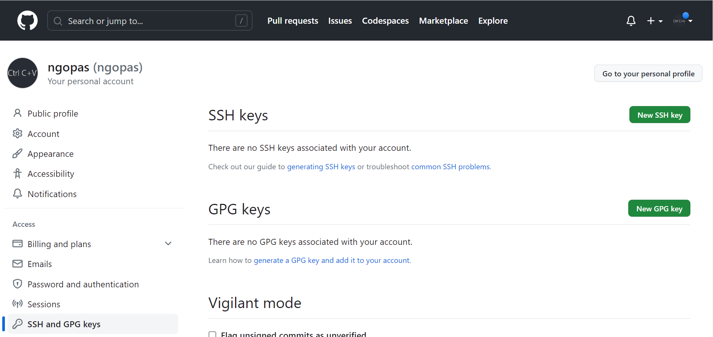
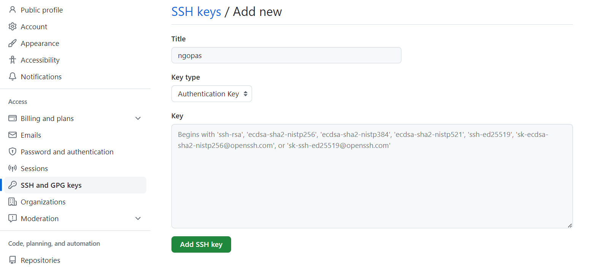

# git multiple account

## Windows


### 1. Create a new SSH key in your terminal/command line/Powershell

```sh
ssh-keygen -t rsa -C “your-email-address@mail.com”
```
your ssh path would be `C:\Users\YOUR_USERNAME/.ssh/id_rsa_YOUR_IDENTIFIABLE_NAME`

Im using `id_rsa_ngopas` as YOUR_IDENTIFIABLE_NAME

on the following option leave it blank

```sh
Enter passphrase (empty for no passphrase):
Enter same passphrase again:
```

make sure it created successfully
```
ls ~/.ssh
```

```sh
Mode                 LastWriteTime         Length Name
----                 -------------         ------ ----
-a----        13-05-2023     10.07           2610 id_rsa_ngopas
-a----        13-05-2023     10.07            578 id_rsa_ngopas.pub
-a----        07-04-2023     20.43           1514 known_hosts
```

As you can see we have both `id_rsa_ngopas` and `id_rsa_ngopas.pub`

`id_rsa_ngopas` is our private key stored on our machine

`id_rsa_ngopas.pub` is the public key which we will provide GitHub with.

### 2. Copy public key `id_rsa_ngopas.pub` to GitHub

open file `id_rsa_ngopas.pub` with your editor

I'm using atom

```sh
atom ~/.ssh/id_rsa_ngopas.pub
```

our file look like below, some I omitted

```cert
ssh-rsa AAAAB3NzaC1yc2EAAAADAQABAAABgQCk+5LUCR+ADwgF5LruWWHbaJoOlikzrDH5E
......
n8jMUcNjIFqgQngidS8pQedp8= your-email-address@mail.com
```

- Copy the content of the file

- navigate to `GitHub account → Settings → SSH and GPG keys`

- click `New SSH key`



- input Title ( it's a good practice to name with `your_machine_your_identifiable`)
- choose Key type `Authentication Key`
- paste content of `id_rsa_ngopas.pub` to key
- click `Add SSH key`



### 3. Config git


```sh
Get-Service ssh-agent | Set-Service -StartupType Automatic -PassThru | Start-Service

start-ssh-agent.cmd

ssh-add C:\Users\ASUS\.ssh\id_rsa_ngopas
```

open git local config file

```sh
git config -e
```

```config
[core]
	repositoryformatversion = 0
	filemode = false
	bare = false
	logallrefupdates = true
	symlinks = false
	ignorecase = true
	sshCommand = ssh -i ~/.ssh/id_rsa_ngopas
	editor = atom
[user]
	email = ngopas@mail.com
	name = ngopas
[remote "origin"]
	url = git@github.com:ngopas/git-multiple-account.git
	fetch = +refs/head/*:refs/remote/origin/*
[branch "main"]
	remote = origin
	merge = refs/heads/main
```


we can set our editor globally

```sh
git config --global core.editor "atom --wait"
```

we can also set config username with cli

```sh
git config user.name "ngopas"
git config user.email ngopas@mail.com
```

### 3. commit and push 
```
git init
git add .
git commit -m "First commit"
git remote add origin git@github.com:ngopas/git-multiple-account.git
git push origin main
```